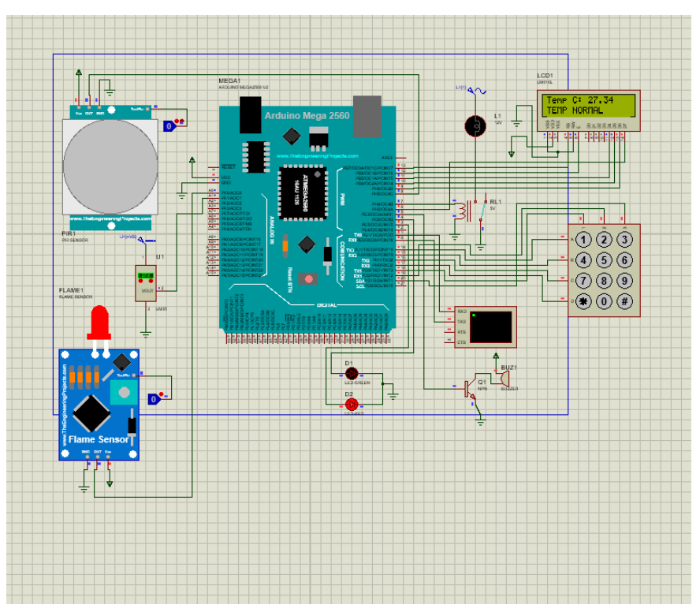

# Arduino Smart Home Simulation

This project aims to simulate a smart home system using Arduino. The simulation is created using the Proteus software with an Arduino board. The system includes the following components:

- Fire Alarm
- Motion-Activated Light System
- Digital Thermometer
- Locking System

## Components Used

### Fire Alarm
- Utilizes a fire sensor and a buzzer.
- When fire is detected, the buzzer activates to sound the alarm.

### Motion-Activated Light System
- Includes a motion sensor and a lamp.
- When motion is detected, the lamp turns on.

### Digital Thermometer
- Uses a temperature sensor and an LCD display.
- Displays the detected temperature on the LCD.
- Shows "Temperature dropped" if below 20°C and "Temperature risen" if above 30°C.

### Locking System
- Incorporates a keypad, red LED, and green LED.
- Defines a 4-digit security code.
- The red LED lights up for incorrect code entries, and the green LED lights up for correct entries.

